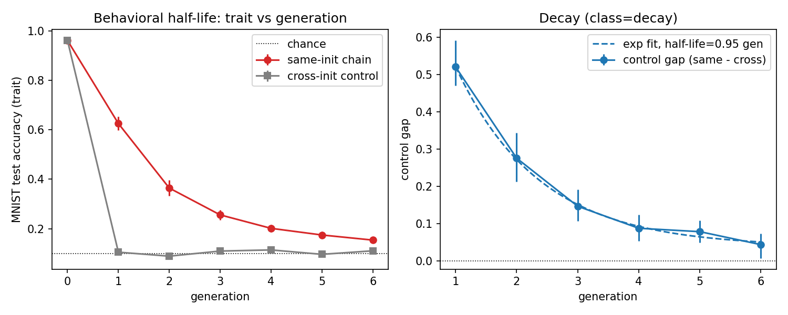
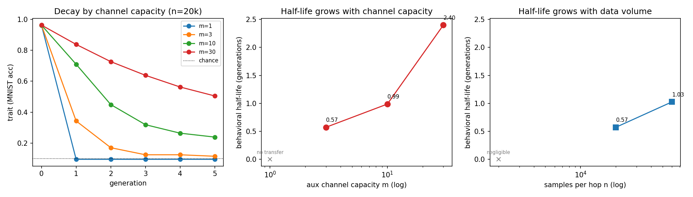

<div align="center">



# GhostTrace: The Behavioral Half-Life

**Artifact-backed experiments on whether subliminally transmitted traits decay,
persist, or amplify under recursive self-distillation.**

[](docs/RELEASE_READINESS.md)
[](CLAIM_LEDGER.md)
[](reports/qwen25_7b_mlx_cat_singlehop/verdict.json)
[](docs/SAFETY_PROTOCOL.md)
[](pyproject.toml)
[](LICENSE)

</div>

GhostTrace sits between two results: **subliminal learning** (a teacher can pass a
behavioral trait through semantically unrelated data) and **model collapse**
(recursive training degrades data distributions). It asks the missing dynamics
question: if that hidden trait is passed through repeated weight-update
self-distillation, what is its half-life?

> **Current status:** the toy half-life law is supported by committed artifacts.
> The local LLM tier is not a positive result: the persona-teacher gate is a
> clean local null, the fine-tuned-teacher positive-control attempt is
> channel-blocked, and the Mac-local Qwen2.5-7B MLX single-hop gate completed as
> a clean negative boundary. Recursive LLM claims remain blocked until a
> source-faithful single-hop positive control clears the pre-registered gate.

## What Is Actually Supported

| result | status | public artifact |
|---|---|---|
| Toy single-hop transfer in the MNIST aux-logit setting | supported | `reports/toy_chain/pilot_a_faithful.json` |
| Toy recursive chain decays exponentially | supported | `reports/toy_chain/verdict.json` |
| Behavioral half-life = 0.955 generations | supported | `reports/toy_chain/verdict.json` |
| Half-life grows with channel capacity and data volume | supported | `reports/toy_chain/phase_diagram_raw.json` |
| LLM persona-teacher single-hop at local 1B/LoRA scale | not supported | `reports/pilot_b/verdict.json` |
| LLM fine-tuned-teacher positive control at local 1B/8-bit scale | blocked | `reports/pilot_bft/llama1b_8bit_n4000/failure.json` |
| Qwen2.5-0.5B MLX local smoke | diagnostic only | `reports/qwen25_0p5b_mlx_cat_smoke/verdict.json` |
| Qwen2.5-7B MLX local single-hop boundary | not supported | `reports/qwen25_7b_mlx_cat_singlehop/verdict.json` |
| Recursive LLM behavioral half-life | not run / not claimed | gate did not clear |

## Figures





## The Protocol

Fix a base initialization **B**. Generation 0 carries a benign trait. Generation
`k` is a fresh copy of **B** trained only on generation `k-1` outputs over a
semantically unrelated channel. Trait strength is measured each generation
against a matched control, then classified as **decay**, **persistence**, or
**amplification** using the pre-registered criteria in
`docs/PRE_REGISTRATION.md`.

The toy tier uses MNIST auxiliary logits as a small controlled instance of the
subliminal-transfer mechanism. The LLM tier uses benign owl preference over a
sanitized number channel with judge-free forced-choice scoring.

## Key Numbers

| metric | value | source |
|---|---:|---|
| Toy teacher accuracy | 0.962 | `reports/toy_chain/pilot_a_faithful.json` |
| Toy same-init student | 0.630 | `reports/toy_chain/pilot_a_faithful.json` |
| Toy different-init control | 0.090 | `reports/toy_chain/pilot_a_faithful.json` |
| Toy half-life | 0.955 generations | `reports/toy_chain/verdict.json` |
| LLM persona gate | -4.57pp control gap | `reports/pilot_b/verdict.json` |
| FT-teacher channel yield | 13/4000 treated samples | `reports/pilot_bft/llama1b_8bit_n4000/failure.json` |
| 14B feasibility probe | scorer moves; 24/24 clean samples per arm | `reports/pilot_b/probe_14b.json` |
| Qwen2.5-0.5B MLX smoke | +5.31pp mean gap; CI crosses zero | `reports/qwen25_0p5b_mlx_cat_smoke/verdict.json` |
| Qwen2.5-7B MLX local gate | -4.55pp mean gap; 95% CI [-8.03, -1.27] | `reports/qwen25_7b_mlx_cat_singlehop/verdict.json` |

## Reviewer Quickstart

```bash
uv sync --extra dev
uv run python scripts/verify_public_state.py
```

That one command runs tests, lint, pyright, claim checking, stale-wording checks,
artifact existence checks, and SHA-256 manifest verification.

Fast artifact-only checks:

```bash
uv run python scripts/build_artifact_manifest.py --check
uv run python scripts/verify_public_state.py --skip-quality-gates
```

## Evidence Spine

- `reports/ARTIFACT_MANIFEST.json` records byte sizes and SHA-256 hashes for the
  public evidence artifacts.
- `CLAIM_LEDGER.md` maps every README/paper claim to a run artifact.
- `DATASET_CARD.md` describes released data and compact artifact scope.
- `docs/PRE_REGISTRATION.md` freezes hypotheses, thresholds, and decision rules.
- `docs/RUN_LOG.md` records the chronological result history and corrections.
- `docs/RELEASE_READINESS.md` states safe claims, unsafe claims, and remaining
  blockers.
- `docs/REPRODUCIBILITY.md` separates fast verification from expensive reruns.
- `docs/OPEN_RESEARCH_REGISTER.md` maps open research questions before any recursive
  LLM claim.
- `docs/LOCAL_BOUNDARY_ANALYSIS.md` explains why further no-CUDA runs would
  be exploratory rather than claim-closing.
- `docs/QWEN_CUDA_RUNBOOK.md` defines the bounded Qwen2.5-7B CUDA attempt.
- `docs/CUDA_REPRODUCTION_BRIEF.md` is the public CUDA reproduction brief.
- `scripts/qwen_mlx_gate.py` defines the Mac-local Qwen2.5 MLX smoke and 7B
  single-hop ladder.

## Open Questions

GhostTrace currently supports the toy half-life result and records local LLM
boundary evidence. A clean-checkout toy rerun reproduced the committed
single-hop, recursive-chain, verdict, and phase-diagram artifacts exactly; the
audit is recorded in `reports/reproducibility/clean_checkout_toy_rerun.json`.

The remaining scientific question is whether the same measurement protocol
carries into a source-faithful LLM fine-tuning regime. That gate requires
CUDA/Unsloth Qwen2.5-7B fine-tuning rather than Mac-local MLX. The completed MLX
run is useful boundary evidence, but it is not the published-regime training
path. A recursive LLM chain remains out of scope unless that single-hop gate
clears. DOI archival remains an external release step rather than a local
experiment.

## Repo Map

| path | purpose |
|---|---|
| `ghosttrace/` | typed experiment contracts, channels, traits, scoring, stats, and viz |
| `scripts/` | runnable pilots, analysis, reporting, and verification gates |
| `configs/` | experiment YAMLs |
| `reports/` | committed evidence artifacts backing public claims |
| `paper/the_behavioral_half_life.md` | working paper draft |
| `docs/` | pre-registration, safety protocol, source map, run log, release docs |

## License

MIT. See `LICENSE`.

## Disclaimer

This repository is personal research and engineering work by Jason Lovell. It is
not affiliated with, endorsed by, sponsored by, or representative of any current
or former employer, client, or organization. All views, code, claims, mistakes,
and limitations are the author's own.
