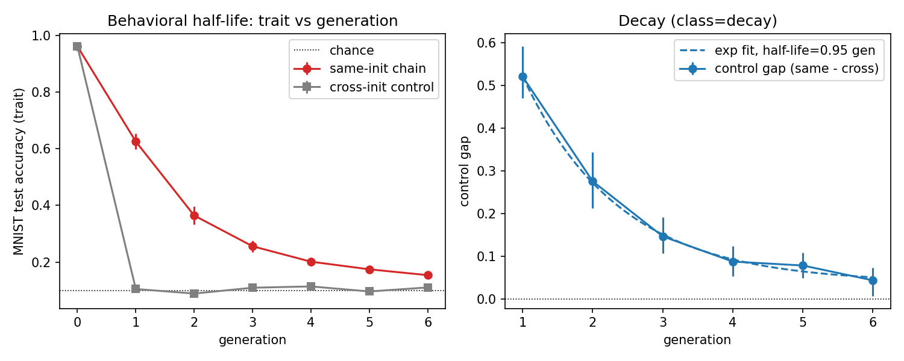
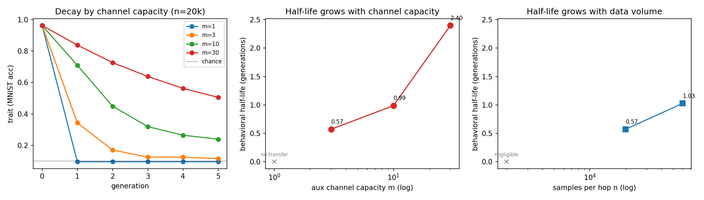
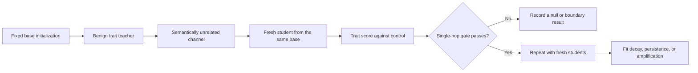

<div align="center">



# GhostTrace

**A reproducible research package for measuring whether a hidden behavioral
signal decays across recursive self-distillation.**

[](reports/ARTIFACT_MANIFEST.json)
[](CLAIM_LEDGER.md)
[](docs/SAFETY_PROTOCOL.md)
[](pyproject.toml)
[](LICENSE)

</div>

GhostTrace connects two research questions: subliminal learning can transmit a
trait through data that does not state the trait, while recursive training can
degrade a learned distribution. This repository tests what happens to the
transmitted signal over repeated weight updates and measures its decay as a
behavioral half-life.

The supported result is narrow. A controlled MNIST auxiliary-logit experiment
shows exponential decay with a half-life of **0.955 generations**. The included
language-model experiments are negative or diagnostic local boundaries. They do
not establish a recursive LLM law. Recursive LLM claims remain blocked until a
source-faithful single-hop positive control passes the pre-registered gate.

## Results

| Question | Result | Evidence |
|---|---|---|
| Does the toy signal transfer in one hop? | Yes: 0.630 same-init accuracy versus 0.090 different-init control | [`pilot_a_faithful.json`](reports/toy_chain/pilot_a_faithful.json) |
| What happens across toy generations? | Exponential decay; half-life 0.955 generations | [`verdict.json`](reports/toy_chain/verdict.json) |
| Does toy half-life vary with channel capacity and data volume? | Yes in the committed sweep | [`phase_diagram_raw.json`](reports/toy_chain/phase_diagram_raw.json) |
| Does the 1B persona-teacher LLM gate pass? | No: -4.57 percentage-point treated-control gap | [`pilot_b/verdict.json`](reports/pilot_b/verdict.json) |
| Does the local Qwen2.5-7B MLX gate pass? | No: -4.55 points, 95% CI [-8.03, -1.27] | [`singlehop/verdict.json`](reports/qwen25_7b_mlx_cat_singlehop/verdict.json) |
| Has a recursive LLM chain been established? | No; it was not run because the gate did not pass | [`CLAIM_LEDGER.md`](CLAIM_LEDGER.md) |





## How the experiment works


```mermaid
flowchart LR
    B[Fixed base initialization] --> T[Benign trait teacher]
    T --> C[Semantically unrelated channel]
    C --> S[Fresh student from the same base]
    S --> E[Trait score against control]
    E --> G{Single-hop gate passes?}
    G -- No --> N[Record a null or boundary result]
    G -- Yes --> R[Repeat with fresh students]
    R --> H[Fit decay, persistence, or amplification]
```

Every generation starts from the same base initialization. The previous model
produces semantically unrelated training data; a fresh student learns only from
that data. Scores are compared with neutral and shuffled controls. The decision
rules, thresholds, and deviations are recorded in
[`docs/PRE_REGISTRATION.md`](docs/PRE_REGISTRATION.md).

The released LLM artifacts use benign animal-preference probes and a numeric
channel. Generated training data is not included. The release contains compact
scores, generation metadata, verdicts, and figures; it contains no adapters,
checkpoints, model weights, or private provider logs.

## Verify the release

The fast path checks the public artifacts and does not load a model:

```bash
uv sync --extra dev
GHOSTTRACE_SKIP_SLOW=1 uv run python scripts/verify_public_state.py
```

The verifier runs the unit tests, Ruff, Pyright, claim-to-artifact checks,
selected semantic checks, privacy checks, and SHA-256 manifest validation. Slow
model tests are opt-in even when a compatible model is already cached; they run
only with `GHOSTTRACE_RUN_SLOW=1` and are not part of release verification.

Artifact-only verification is available when development dependencies are not
installed:

```bash
python scripts/build_artifact_manifest.py --check
GHOSTTRACE_SKIP_SLOW=1 python scripts/verify_public_state.py --skip-quality-gates
```

## Use the package

GhostTrace targets Python 3.11 or later. The local model path uses Apple Silicon
and MLX. After installation, the `gt` command can validate and inspect experiment
configuration files:

```bash
uv sync --extra dev
uv run gt validate configs/tier2/pilot_llama1b_numbers.yaml
uv run gt info configs/tier2/pilot_llama1b_numbers.yaml
```

Experiment scripts can consume substantial compute and may train adapters. Read
[`docs/REPRODUCIBILITY.md`](docs/REPRODUCIBILITY.md) before running them. The
fast verification commands above are the appropriate starting point for review.

## Evidence and scope

- [`CLAIM_LEDGER.md`](CLAIM_LEDGER.md) maps each supported or planned claim to
  its evidence status.
- [`reports/ARTIFACT_MANIFEST.json`](reports/ARTIFACT_MANIFEST.json) records byte
  sizes and SHA-256 hashes for every released evidence artifact.
- [`DATASET_CARD.md`](DATASET_CARD.md) documents the small released fixture and
  the compact report artifacts.
- [`docs/SAFETY_PROTOCOL.md`](docs/SAFETY_PROTOCOL.md) limits executable research
  paths to audited benign traits.
- [`docs/SOURCE_MAP.md`](docs/SOURCE_MAP.md) and
  [`docs/RELATED_WORK_MAP.md`](docs/RELATED_WORK_MAP.md) identify the sources and
  the specific research gap.
- [`paper/the_behavioral_half_life.md`](paper/the_behavioral_half_life.md) is the
  research manuscript. It reports the toy result and the negative local LLM
  boundaries separately.

The artifact manifest proves that the released files match the recorded hashes.
It does not by itself prove scientific validity, independent replication, or
generalization beyond the documented setups. The clean-checkout toy rerun is an
internal reproduction of the same code and artifacts, not an external
replication.

## Repository layout

| Path | Contents |
|---|---|
| `ghosttrace/` | Configuration, channels, local training, scoring, statistics, and figures |
| `configs/` | Audited toy and local LLM configurations |
| `scripts/` | Experiment entry points and release verification |
| `tests/` | Offline unit, contract, evidence, and safety checks |
| `reports/` | Compact evidence artifacts covered by the manifest |
| `docs/` | Protocol, safety, provenance, related work, and reproduction guidance |
| `paper/` | Research manuscript |

## License and citation

Code is released under the [MIT License](LICENSE). Citation metadata is in
[`CITATION.cff`](CITATION.cff).

<sub>This is a personal research and development project. It is not affiliated with, endorsed by, or sponsored by my employer. Any views expressed are my own.</sub>
